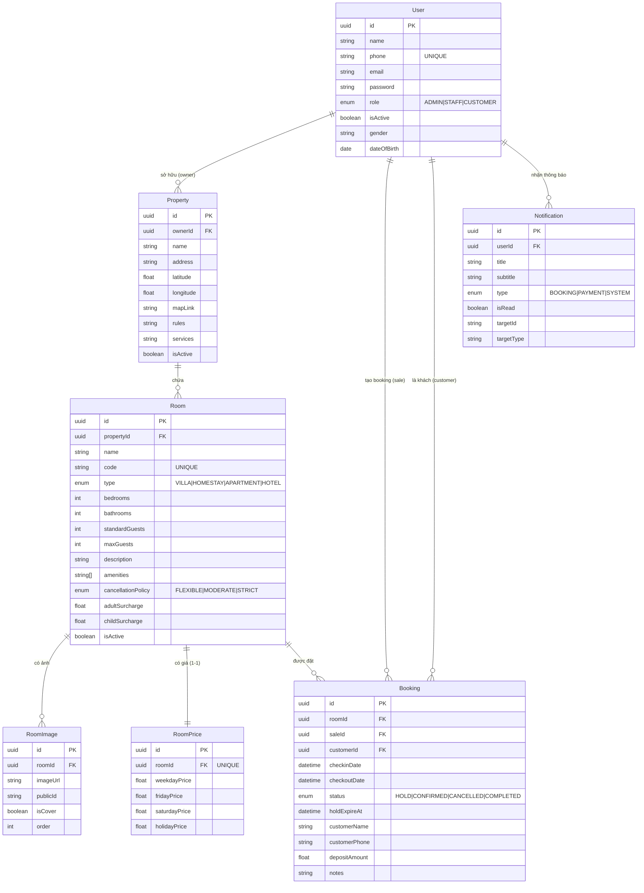
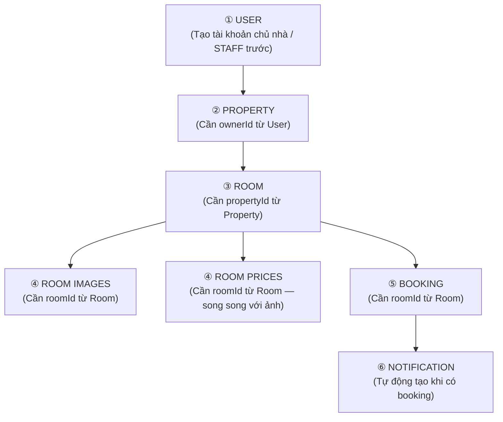
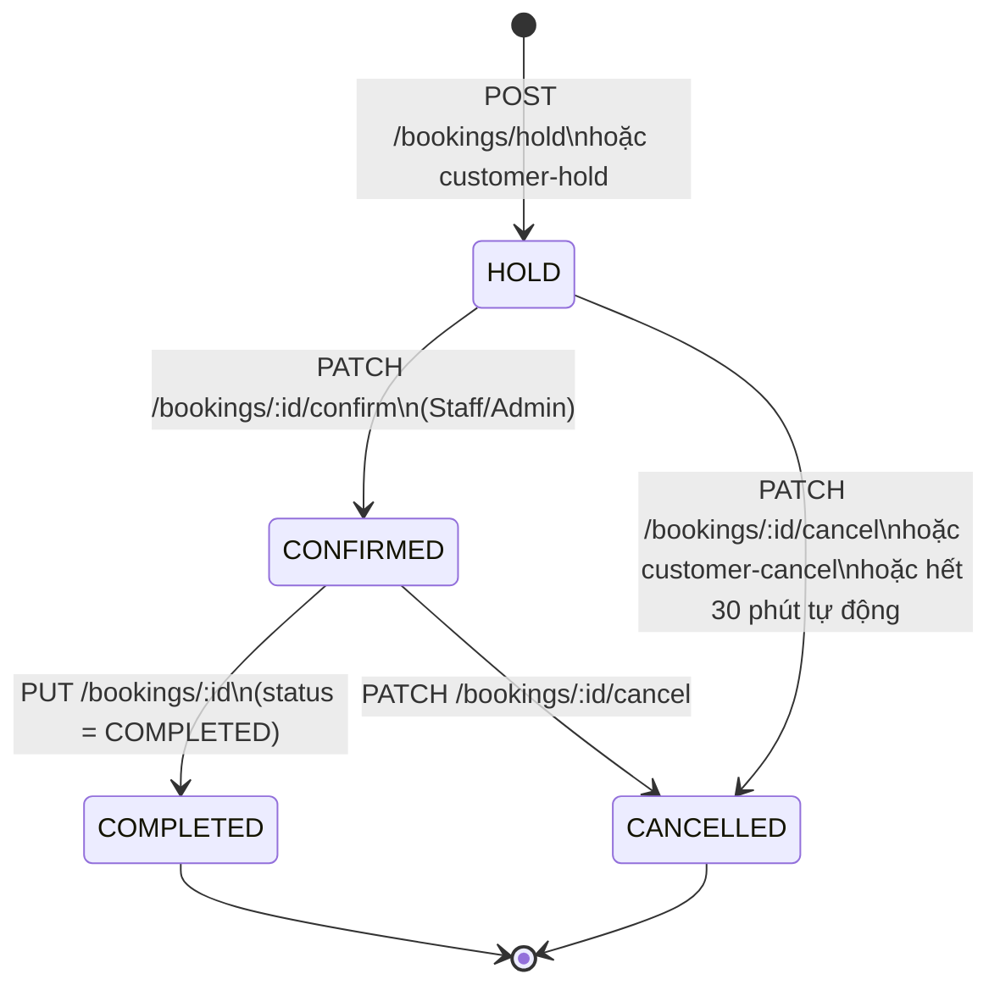
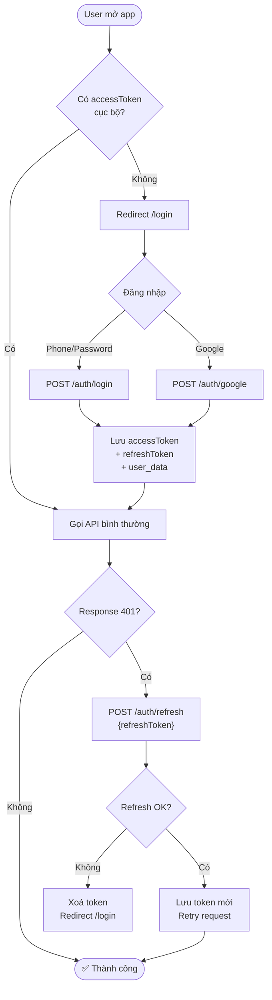
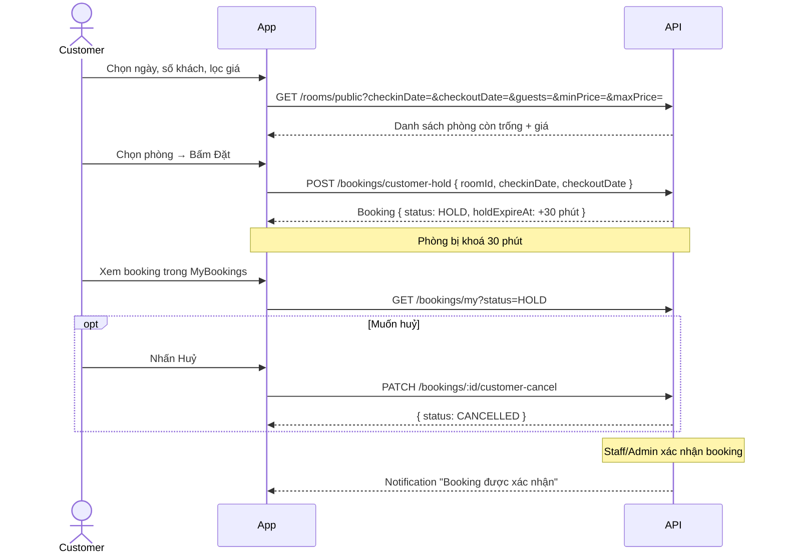
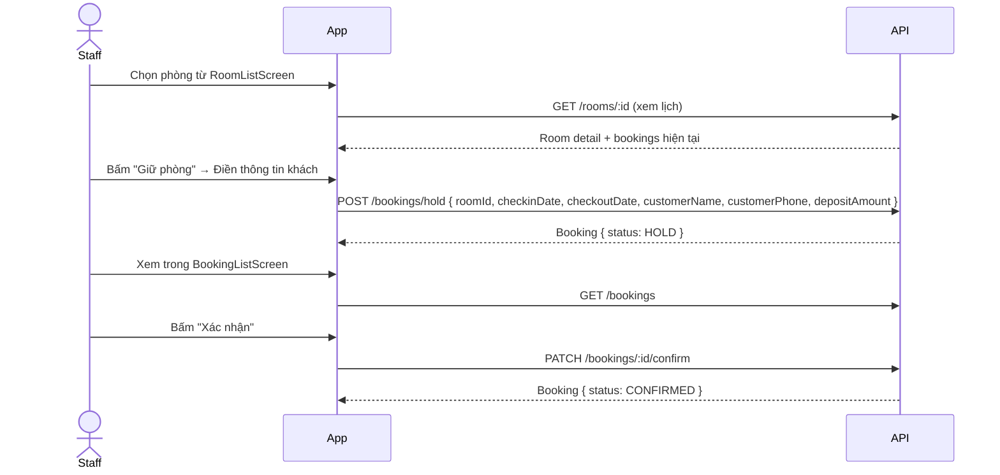
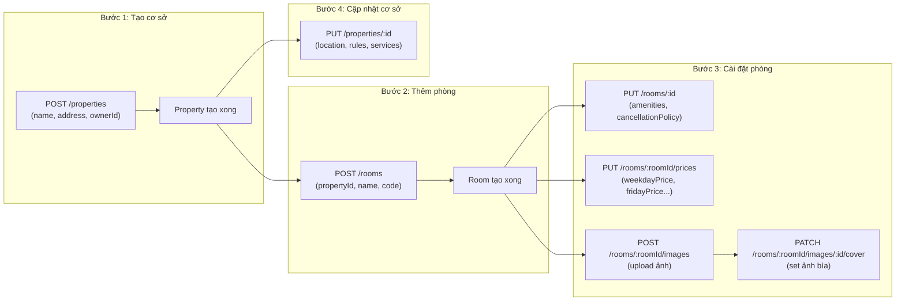

# 📘 Halong24h — Hướng dẫn CRUD & Luồng dữ liệu

> **Base URL:** `http://103.183.118.148:3000`
> **Auth:** `Authorization: Bearer {accessToken}` cho tất cả endpoint có 🔒
> **Response format:** `{ "success": true/false, "data": ..., "message": "..." }`

---

## 📌 Mục lục

1. [Sơ đồ quan hệ thực thể (ERD)](#1-sơ-đồ-quan-hệ-thực-thể-erd)
2. [Thứ tự tạo dữ liệu (Creation Order)](#2-thứ-tự-tạo-dữ-liệu-creation-order)
3. [CRUD — User (Người dùng)](#3-crud--user)
4. [CRUD — Property (Cơ sở)](#4-crud--property)
5. [CRUD — Room (Phòng)](#5-crud--room)
6. [CRUD — Room Images (Ảnh phòng)](#6-crud--room-images)
7. [CRUD — Room Prices (Bảng giá)](#7-crud--room-prices)
8. [CRUD — Bookings (Đặt phòng)](#8-crud--bookings)
9. [CRUD — Notifications (Thông báo)](#9-crud--notifications)
10. [Luồng xác thực (Auth Flow)](#10-luồng-xác-thực-auth-flow)
11. [Luồng đặt phòng đầy đủ](#11-luồng-đặt-phòng-đầy-đủ)
12. [Luồng quản lý cơ sở đầy đủ](#12-luồng-quản-lý-cơ-sở-đầy-đủ)
13. [Màn hình → Endpoint nhanh](#13-màn-hình--endpoint-nhanh)

---

## 1. Sơ đồ quan hệ thực thể (ERD)



---

## 2. Thứ tự tạo dữ liệu (Creation Order)

> ⚠️ **Phải tạo theo đúng thứ tự này** vì các bảng sau phụ thuộc vào bảng trước.



| Bước | Entity | Phụ thuộc vào | Ghi chú |
|------|--------|---------------|---------|
| 1 | **User** | — | Tạo đầu tiên. Cần có `ADMIN` để tạo các Users khác |
| 2 | **Property** | `User` (ownerId) | Cần `ownerId` là UUID của một User đã tồn tại |
| 3 | **Room** | `Property` (propertyId) | Phòng phải thuộc 1 cơ sở |
| 4a | **RoomImage** | `Room` (roomId) | Có thể upload nhiều ảnh cùng lúc |
| 4b | **RoomPrice** | `Room` (roomId) | Mỗi phòng có đúng 1 bảng giá (quan hệ 1-1) |
| 5 | **Booking** | `Room` (roomId) | Cần phòng đã tồn tại và còn trống |
| 6 | **Notification** | `User`, `Booking` | Tự sinh sau khi có booking |

---

## 3. CRUD — User

> 🔒 Chỉ ADMIN mới có quyền tạo/xoá/sửa Users khác. User thường chỉ sửa được profile của mình.

### Tạo User (Create)

```
POST /auth/register        → Tự đăng ký (STAFF hoặc CUSTOMER)
POST /users   🔒           → Admin tạo (có thể tạo ADMIN role)
```

**Body bắt buộc:**

| Field | Type | Ghi chú |
|-------|------|---------|
| `name` | string | Họ tên |
| `phone` | string | Số điện thoại (unique) |
| `password` | string | Tối thiểu 6 ký tự |
| `role` | string | `ADMIN` / `STAFF` / `CUSTOMER` |

**Body tuỳ chọn:** `email`, `isActive`

---

### Đọc User (Read)

```
GET /users         🔒   → Danh sách tất cả. Query: ?role=STAFF
GET /users/:id     🔒   → Chi tiết 1 user
```

---

### Cập nhật User (Update)

```
PUT /users/:id   🔒
```

| Field | Ai dùng | Màn hình |
|-------|---------|----------|
| `name`, `email`, `gender`, `dateOfBirth` | Chính user | PersonalInfoScreen |
| `phone`, `role`, `isActive` | Admin | UserFormScreen |
| `password` | Admin | UserFormScreen |

---

### Xoá User (Delete)

```
DELETE /users/:id   🔒   → Vô hiệu hoá tài khoản
```

---

## 4. CRUD — Property

> 🏠 Property là **cơ sở** (villa, homestay...). Mỗi Property thuộc 1 `owner` (User). Một Property có thể có nhiều Rooms.

### Tạo Property (Create)

```
POST /properties   🔒
```

**Body bắt buộc:**

| Field | Type | Ghi chú |
|-------|------|---------|
| `name` | string | Tên cơ sở |
| `address` | string | Địa chỉ |
| `ownerId` | string (UUID) | ID của User chủ nhà — **phải tồn tại trước** |

**Body tuỳ chọn:** `latitude`, `longitude`, `mapLink`, `isActive`

---

### Đọc Property (Read)

```
GET /properties         🔒   → Danh sách tất cả cơ sở
GET /properties/:id     🔒   → Chi tiết 1 cơ sở (kèm số phòng _count.rooms)
```

---

### Cập nhật Property (Update)

```
PUT /properties/:id   🔒
```

Các màn hình con cụ thể cập nhật từng phần:

| Màn hình con | Field cập nhật |
|-------------|----------------|
| `PropertyInfoScreen` | `name`, `address`, `isActive` |
| `PropertyLocationScreen` | `latitude`, `longitude`, `mapLink` |
| `PropertyRulesScreen` | `rules` |
| `PropertyServicesScreen` | `services` |

> ⚠️ `PropertyAmenitiesScreen` và `PropertyCancellationScreen` gọi **`PUT /rooms/:id`** (không phải endpoint này).

---

### Xoá Property (Delete)

```
DELETE /properties/:id   🔒
```

> 💡 Xoá Property sẽ **cascade xoá** toàn bộ Rooms bên trong (do `onDelete: Cascade` ở schema).

---

## 5. CRUD — Room

> 🛏️ Room là **phòng** thuộc 1 Property. Phòng có code unique, loại, sức chứa, và liên kết ảnh + giá.

### Tạo Room (Create)

```
POST /rooms   🔒
```

**Body bắt buộc:**

| Field | Type | Ghi chú |
|-------|------|---------|
| `propertyId` | string (UUID) | **Property phải tồn tại trước** |
| `name` | string | Tên phòng |
| `code` | string | Mã phòng — **unique toàn hệ thống** |

**Body tuỳ chọn:**

| Field | Type | Enum / Ghi chú |
|-------|------|----------------|
| `type` | string | `VILLA` / `HOMESTAY` / `APARTMENT` / `HOTEL` |
| `bedrooms` | int | |
| `bathrooms` | int | |
| `standardGuests` | int | Số khách tiêu chuẩn |
| `maxGuests` | int | Số khách tối đa |
| `amenities` | string[] | VD: `["Wifi", "Bể bơi", "BBQ"]` |
| `cancellationPolicy` | string | `FLEXIBLE` / `MODERATE` / `STRICT` |
| `adultSurcharge` | float | Phụ thu người lớn (VNĐ) |
| `childSurcharge` | float | Phụ thu trẻ em (VNĐ) |
| `isActive` | boolean | |

---

### Đọc Room (Read)

```
GET /rooms              🔒   → Danh sách (cho STAFF/ADMIN). Query: ?propertyId=
GET /rooms/public            → Danh sách công khai (cho CUSTOMER). Query: ?checkinDate=&checkoutDate=&guests=&minPrice=&maxPrice=
GET /rooms/:id          🔒   → Chi tiết 1 phòng (kèm images, price, property)
```

---

### Cập nhật Room (Update)

```
PUT /rooms/:id   🔒
```

Được gọi từ nhiều màn hình:

| Màn hình | Field cập nhật |
|----------|----------------|
| `RoomDetailScreen` | Tất cả thông tin phòng |
| `PropertyAmenitiesScreen` | `amenities` |
| `PropertyCancellationScreen` | `cancellationPolicy` |

---

### Xoá Room (Delete)

```
DELETE /rooms/:id   🔒
```

> 💡 Xoá Room sẽ **cascade xoá** toàn bộ ảnh (RoomImage) và giá (RoomPrice) của phòng đó.

---

## 6. CRUD — Room Images

> 🖼️ Ảnh được lưu trên **Cloudinary**. Mỗi phòng có thể có nhiều ảnh, 1 ảnh là ảnh bìa (`isCover: true`).

### Upload ảnh (Create)

```
POST /rooms/:roomId/images   🔒
Content-Type: multipart/form-data
Body: images (File[], tối đa 20 ảnh)
```

---

### Set ảnh bìa (Update)

```
PATCH /rooms/:roomId/images/:imageId/cover   🔒
```

> Không cần body. Tự động set ảnh này là bìa và bỏ bìa các ảnh khác.

---

### Xoá ảnh (Delete)

```
DELETE /rooms/:roomId/images/:imageId   🔒
```

> Xoá đồng thời trên Cloudinary và database.

> ℹ️ Không có API read riêng — ảnh được trả về trong `GET /rooms/:id` qua field `images: [RoomImageObject]`.

---

## 7. CRUD — Room Prices

> 💰 Mỗi phòng có **đúng 1 bảng giá** (quan hệ 1-1). Dùng `PUT` để tạo mới hoặc cập nhật (Upsert).

### Tạo / Cập nhật giá (Upsert)

```
PUT /rooms/:roomId/prices   🔒
```

**Body (tất cả bắt buộc):**

| Field | Type | Mô tả |
|-------|------|-------|
| `weekdayPrice` | float | Giá Thứ 2 – Thứ 5 (VNĐ) |
| `fridayPrice` | float | Giá Thứ 6 (VNĐ) |
| `saturdayPrice` | float | Giá Thứ 7 (VNĐ) |
| `holidayPrice` | float | Giá ngày lễ / cao điểm (VNĐ) |

> ℹ️ Không có API xoá giá riêng — giá bị xoá khi Room bị xoá (cascade).
> ℹ️ Giá được trả về trong `GET /rooms/:id` qua field `price: RoomPriceObject`.

---

## 8. CRUD — Bookings

> 📅 Booking có vòng đời: **HOLD → CONFIRMED → COMPLETED** hoặc **HOLD/CONFIRMED → CANCELLED**.

### Vòng đời Booking (State Machine)



> ⏰ **HOLD tự động hết hạn sau 30 phút** nếu chưa được Confirm.
> ❗ Customer chỉ có thể huỷ booking có status **HOLD**. Booking CONFIRMED chỉ Staff/Admin mới huỷ được.

---

### Tạo Booking (Create)

**Staff/Admin giữ phòng:**
```
POST /bookings/hold   🔒
```

**Customer đặt phòng:**
```
POST /bookings/customer-hold   🔒
```

**Body:**

| Field | Type | Bắt buộc | Ghi chú |
|-------|------|----------|---------|
| `roomId` | string (UUID) | ✅ | Phòng phải còn trống |
| `checkinDate` | string (ISO) | ✅ | VD: `2026-04-20T14:00:00Z` |
| `checkoutDate` | string (ISO) | ✅ | |
| `customerName` | string | ❌ | |
| `customerPhone` | string | ❌ | |
| `depositAmount` | float | ❌ | Chỉ Staff/Admin mới điền |
| `notes` | string | ❌ | |

---

### Đọc Booking (Read)

```
GET /bookings              🔒   → All bookings (Staff/Admin). Query: ?roomId=
GET /bookings/my           🔒   → Bookings của Customer hiện tại. Query: ?status=
GET /bookings/calendar/:roomId  🔒   → Lịch theo phòng. Query: ?year=&month=
```

---

### Cập nhật Booking (Update)

```
PUT /bookings/:id               🔒   → Sửa thông tin booking
PATCH /bookings/:id/confirm     🔒   → HOLD → CONFIRMED
PATCH /bookings/:id/cancel      🔒   → Huỷ (Staff/Admin)
PATCH /bookings/:id/customer-cancel  🔒   → Huỷ (Customer, chỉ khi HOLD)
```

**Body cho `PUT /bookings/:id` (tất cả tuỳ chọn):**

| Field | Type |
|-------|------|
| `checkinDate` | string (ISO) |
| `checkoutDate` | string (ISO) |
| `customerName` | string |
| `customerPhone` | string |
| `depositAmount` | float |
| `notes` | string |
| `status` | `HOLD` / `CONFIRMED` / `CANCELLED` / `COMPLETED` |

---

### Xoá Booking

> ℹ️ Không có API DELETE booking. Thay vào đó, dùng `PATCH /bookings/:id/cancel`.

---

## 9. CRUD — Notifications

> 🔔 Thông báo được **tự động tạo** bởi hệ thống (backend). Frontend chỉ đọc và đánh dấu đã đọc.

### Đọc (Read)

```
GET /notifications              🔒   → Danh sách thông báo của user
GET /notifications/unread-count 🔒   → Số badge chưa đọc → { data: { count: 5 } }
```

### Cập nhật (Update — Đánh dấu đọc)

```
PATCH /notifications/:id/read   🔒   → Đánh dấu 1 thông báo đã đọc
PATCH /notifications/read-all   🔒   → Đánh dấu tất cả đã đọc
```

> ℹ️ Không có Create/Delete thủ công từ phía client.

---

## 10. Luồng xác thực (Auth Flow)



| Endpoint | Mô tả |
|----------|-------|
| `POST /auth/login` | Đăng nhập bằng SĐT + mật khẩu |
| `POST /auth/register` | Tự đăng ký (role: STAFF hoặc CUSTOMER) |
| `POST /auth/google` | Đăng nhập / đăng ký qua Google |
| `POST /auth/refresh` | Lấy accessToken mới (không cần header auth) |
| `POST /auth/logout` 🔒 | Đăng xuất |
| `POST /auth/forgot-password` | Gửi link reset qua SĐT/email |
| `POST /auth/reset-password` | Đặt lại mật khẩu bằng token |
| `POST /auth/change-password` 🔒 | Đổi mật khẩu (cần biết mật khẩu cũ) |

---

## 11. Luồng đặt phòng đầy đủ

### 11.1 Customer đặt phòng



---

### 11.2 Staff giữ phòng



---

### 11.3 Trạng thái lịch phòng (Calendar Grid)

```
GET /calendar/property-groups   → Lấy danh sách cơ sở để hiển thị tab
GET /calendar/grid?propertyGroupId=&startDate=&endDate=
```

Mỗi ô trong lịch có status:

| Status | Màu | Hành động |
|--------|-----|-----------|
| `AVAILABLE` | 🟢 Xanh | Customer/Staff có thể đặt |
| `HOLD` | 🟡 Vàng | Đang giữ, chờ confirm |
| `BOOKED` | 🔴 Đỏ | Đã đặt, không thể đặt thêm |

**Owner có thể khoá/mở phòng thủ công:**
```
POST /calendar/lock    { roomId, date }   → AVAILABLE → HOLD (khoá)
POST /calendar/unlock  { roomId, date }   → HOLD → AVAILABLE (mở)
```

---

## 12. Luồng quản lý cơ sở đầy đủ



---

## 13. Màn hình → Endpoint nhanh

### 🔐 Auth

| Màn hình | Endpoints |
|----------|-----------|
| LoginScreen | `POST /auth/login`, `POST /auth/google` |
| RegisterScreen | `POST /auth/register` |
| ForgotPasswordScreen | `POST /auth/forgot-password`, `POST /auth/reset-password` |
| ChangePasswordScreen | `POST /auth/change-password` |
| PersonalInfoScreen | `PUT /users/:id` |

---

### 👤 Admin — Quản lý Users

| Màn hình | Endpoints |
|----------|-----------|
| UserListScreen | `GET /users?role=`, `DELETE /users/:id` |
| UserFormScreen (new) | `POST /users` |
| UserFormScreen (edit) | `GET /users/:id`, `PUT /users/:id` |

---

### 🏠 Quản lý cơ sở

| Màn hình | Endpoints |
|----------|-----------|
| PropertyManagementScreen | `GET /properties`, `DELETE /properties/:id` |
| PropertyAddScreen | `POST /properties` |
| PropertyManageScreen | `GET /properties/:id`, `GET /rooms?propertyId=`, `DELETE /rooms/:id` |
| PropertyInfoScreen | `PUT /properties/:id` (name, address, isActive) |
| PropertyLocationScreen | `PUT /properties/:id` (lat, lng, mapLink) |
| PropertyRulesScreen | `PUT /properties/:id` (rules) |
| PropertyServicesScreen | `PUT /properties/:id` (services) |
| PropertyImagesScreen | `POST /rooms/:id/images`, `DELETE /rooms/:id/images/:imgId`, `PATCH .../cover` |
| PropertyPricingScreen | `PUT /rooms/:roomId/prices` |
| PropertyAmenitiesScreen | `PUT /rooms/:id` (amenities) |
| PropertyCancellationScreen | `PUT /rooms/:id` (cancellationPolicy) |

---

### 📋 Quản lý Booking

| Màn hình | Endpoints |
|----------|-----------|
| BookingListScreen | `GET /bookings`, `PATCH .../confirm`, `PATCH .../cancel`, `PUT /bookings/:id` |
| HoldRoomScreen | `POST /bookings/hold` |
| BookingCalendarScreen | `GET /calendar/property-groups`, `GET /calendar/grid`, `GET /calendar/admin-contact` |
| OwnerCalendarScreen | `GET /calendar/property-groups?ownerId=`, `GET /calendar/grid`, `POST /calendar/lock`, `POST /calendar/unlock` |
| RoomDetailScreen | `GET /rooms/:id`, `PUT /rooms/:id`, `GET /bookings/calendar/:roomId` |

---

### 📱 Customer

| Màn hình | Endpoints |
|----------|-----------|
| CustomerHomeScreen | `GET /rooms/public` |
| SearchRoomScreen | `GET /rooms/public` (có filter), `POST /bookings/customer-hold` |
| MyBookingsScreen | `GET /bookings/my`, `PATCH /bookings/:id/customer-cancel` |
| NotificationScreen | `GET /notifications`, `PATCH /notifications/:id/read`, `PATCH /notifications/read-all` |

---

## 📊 Tổng kết endpoints (46 endpoints)

| Nhóm | Đã có | Cần tạo mới |
|------|-------|-------------|
| Auth | 8 | 0 |
| Users | 5 | 0 |
| Properties | 5 | 0 |
| Rooms | 6 | 0 |
| Room Images | 3 | 0 |
| Room Prices | 1 | 0 |
| Bookings | 9 | 0 |
| Calendar | 0 | 5 🔴 CAO |
| Notifications | 0 | 4 🟡 TRUNG BÌNH |
| **Tổng** | **37** | **9** |

> 🔴 **Ưu tiên cao:** Calendar endpoints (app đang dùng mock data)
> 🟡 **Ưu tiên trung bình:** Notification endpoints
